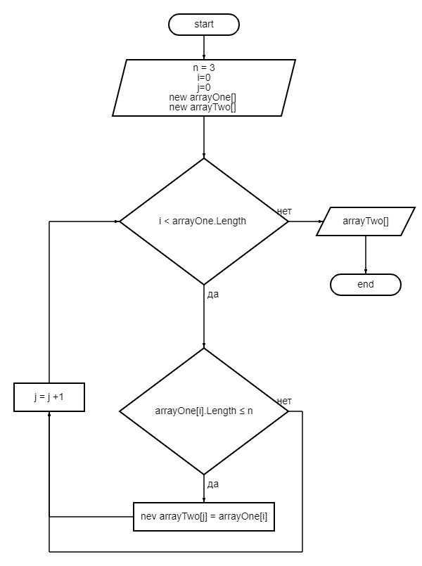

# Итоговая проверочная работа.
## Задание
1. Создать репозиторий на GitHub
2. Нарисовать блок-схему алгоритма
3. Снабдить репозиторий оформленным текстовым описанием решения
4. Написать программу, решающую поставленую задачу
5. Использовать контроль версий в работе над пректом
### Задача:
Написать программу, которая из имеющегося массива строк вормирует массив из сторок, длинна которых меньше либо равна 3 символа. Первоначальный массив можно ввести с клавиатуры, либо задать на старте выполнение алгоритма. При решении не рекомендуется пользоваться коллекциями, лучше обойтись иключительно массивами.
### Примеры:
["hello", "2", "world", ":-)"] -> ["2", ":-)"]

["1234", "1567", "-2", "computer science"] -> ["-2"]

["Russia", "Denmark", "Kazan"] -> []

## Решение
1. Создаем блок-схему алгоритма решения задачи

## Описание алгоритма решения задачи.
1. Пользователь вводит строки.
2. Перебирпем значения исходного массива.
3. Проверяем каждое знаение массва по очереди на соответствие условию: длинна строки меньше или равна трем (3).
4. Если условия выполняются выбранной строкой из исходного массива то данное значение кладем в новый массив.
5. Повторяем пункты 2 и 3 до тех пор пока не достигнем конца исходного массива.
6. Возращаем новый заполненый массив как результат.